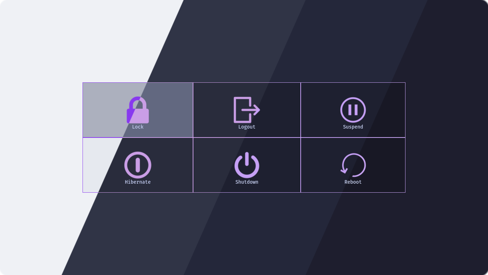
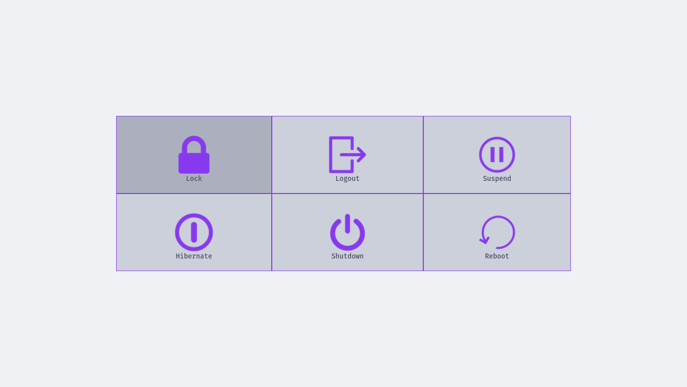
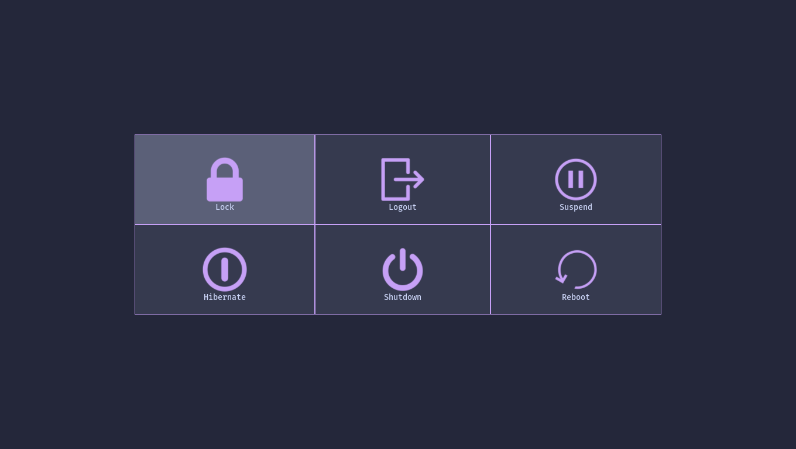
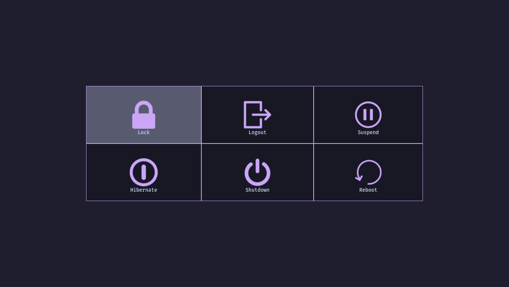

<h3 align="center">
	<br/>
	
	Catppuccin for <a href="https://github.com/ArtsyMacaw/wlogout">wlogout</a>
	
</h3>

<p align="center">
	<a href="https://github.com/catppuccin/wlogout/stargazers"></a>
	<a href="https://github.com/catppuccin/wlogout/issues"></a>
	<a href="https://github.com/catppuccin/wlogout/contributors"></a>
</p>

<p align="center">
	
</p>

## Previews

<details>
<summary>🌻 Latte</summary>

</details>
<details>
<summary>🪴 Frappé</summary>

</details>
<details>
<summary>🌺 Macchiato</summary>

</details>
<details>
<summary>🌿 Mocha</summary>

</details>

## Usage

1. Copy the contents of the desired flavor and accent's css file to `~/.config/wlogout/style.css`.
2. Copy the icons corresponding to the desired flavor and accent from either [./icons/wlogout](./icons/wlogout) or [./icons/wleave](./icons/wleave) to `~/.config/wlogout/`.
3. Copy the below text to `~/.config/wlogout/style.css` to set the icons.
```css
#lock {
    background-image: url("/home/<USER>/.config/wlogout/icons/lock.svg");
}

#logout {
    background-image: url("/home/<USER>/.config/wlogout/icons/logout.svg");
}

#suspend {
    background-image: url("/home/<USER>/.config/wlogout/icons/suspend.svg");
}

#hibernate {
    background-image: url("/home/<USER>/.config/wlogout/icons/hibernate.svg");
}

#shutdown {
    background-image: url("/home/<USER>/.config/wlogout/icons/shutdown.svg");
}

#reboot {
    background-image: url("/home/<USER>/.config/wlogout/icons/reboot.svg");
}
```

<!-- The FAQ section is optional. Remove if needed.-->
## 🙋 FAQ

- Q: **_"Does this also work with [wleave](https://github.com/AMNatty/wleave)?"_**\
  A: Yes, it does. In fact, there is even a set of wleave-style icons in `./icons/wleave`.

## 💝 Thanks to

- [Anomalocaridid](https://github.com/Anomalocaridid)

&nbsp;

<p align="center">
	
</p>

<p align="center">
	Copyright &copy; 2021-present <a href="https://github.com/catppuccin" target="_blank">Catppuccin Org</a>
</p>

<p align="center">
	<a href="https://github.com/catppuccin/catppuccin/blob/main/LICENSE"></a>
</p>
